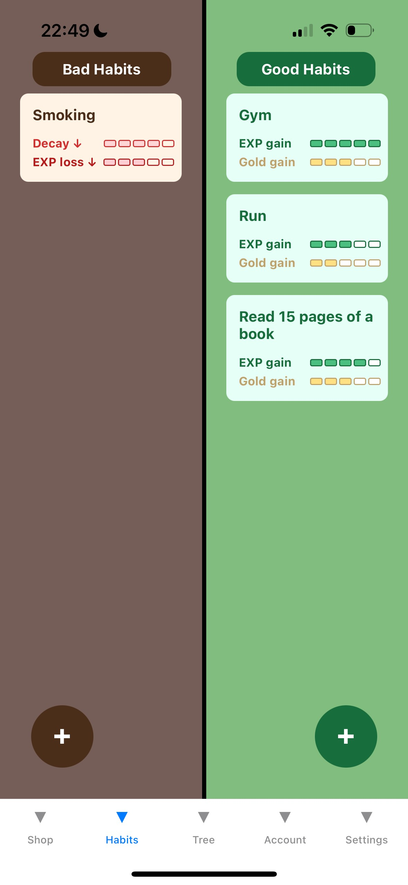
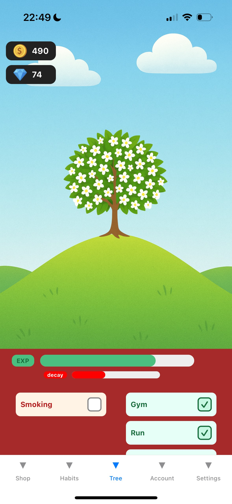

# Self‑Improvement Tree

A gamified habit app that grows a beautiful tree as you build daily routines. Offline‑first mobile app (React Native + Expo) with a secure Spring Boot backend.

---

## Demo

Screenshots

---

## Highlights

- Offline‑first: play as Guest, then log in — your progress links seamlessly
- Account‑first merge: on login, server account data overrides local; new accounts adopt guest progress
- Secure auth: JWT, email verification, and password reset via code (with optional username change)
- Habit tracking that levels up your tree; daily rewards and upgrades in the shop (coins/gems)
- Clean, mobile‑first UI built with Expo

---

## Tech

- Mobile: React Native (Expo), Context API, AsyncStorage
- Backend: Spring Boot, JWT, JavaMailSender, JPA (PostgreSQL or H2)

---

## Run locally

Backend
- Configure DB + SMTP in `application.properties` (or stub email for demos)
- Run the Spring Boot app

Frontend
- Set API base in `Frontend/config.ts`
- Install deps and start Expo: `npm install` → `npx expo start`

---

## License

MIT
