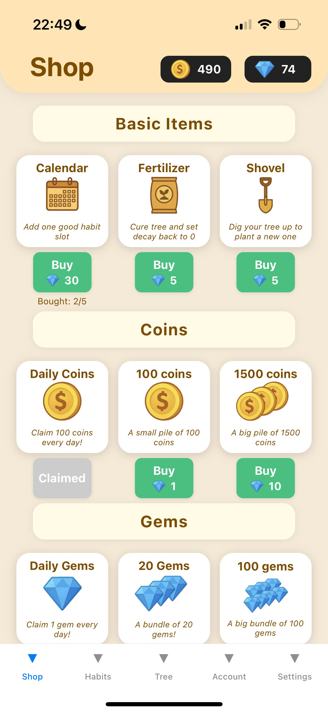

# Self‑Improvement Tree 🌱

A gamified habit-tracking app that grows a beautiful tree as you build daily routines. Full-stack mobile app with offline-first architecture, secure authentication, and real payment processing.

**React Native (Expo) + Spring Boot + Stripe Integration**

---

## Demo 🎬

<p align="center">
  
</p>

---

## Key Features ✨

### 🎮 Core Gameplay
- **Habit Tracking**: Daily check-ins with visual feedback
- **Tree Growth System**: Your tree grows as you build consistent habits
- **Reward Economy**: Earn coins and gems through daily claims
- **Shop System**: Spend currency on tree upgrades and customizations

### 🔐 Authentication & Data Sync
- **Offline-First**: Start as guest, full functionality without internet
- **Seamless Login**: Register and sync progress across devices
- **Email Verification**: JWT-based auth with email confirmation codes
- **Password Reset**: Secure password recovery via email
- **Smart Merge Logic**: On login, server data takes priority; new accounts adopt guest progress

### 💳 Payment Integration
- **Stripe Integration**: PCI-compliant real money transactions
- **In-App Purchases**: Buy gems with credit/debit cards
- **Webhook Support**: Real-time payment verification
- **Test Mode Ready**: Full test environment with test cards

### 🛡️ Security
- JWT authentication
- Bcrypt password hashing
- Email verification system
- Webhook signature verification
- SSL/TLS encrypted payments

---

## Tech Stack 🛠

**Frontend:**
- React Native (Expo SDK 54)
- TypeScript
- Context API for state management
- AsyncStorage for offline data
- @stripe/stripe-react-native

**Backend:**
- Spring Boot 3.5
- Spring Security + JWT
- JPA/Hibernate
- H2 Database (dev) / PostgreSQL (production)
- JavaMailSender (SMTP)
- Stripe Java SDK

---

## Quick Start ▶️

```bash
# 1. Clone repository
git clone https://github.com/Szostak21/Self-Improvement-Tree.git
cd Self-Improvement-Tree

# 2. Run automated setup
./setup.sh

# 3. Configure .env with your credentials (Gmail, Stripe)

# 4. Start backend
./run-backend.sh

# 5. Start frontend (new terminal)
./run-frontend.sh
```

**Full setup guide:** [SETUP.md](SETUP.md)

---

## Architecture Highlights 🏗️

**Payment Flow:**
- Frontend initiates payment with Stripe CardField (PCI-compliant)
- Backend creates PaymentIntent via Stripe API
- Payment confirmation handled by Stripe SDK
- Webhooks verify successful transactions
- User balance updated only after payment success

**Auth & Sync:**
- Guest data stored locally in AsyncStorage
- JWT-based authentication with refresh tokens
- Email verification via secure codes
- Smart merge: server data wins on login, guest progress promoted for new accounts

**Offline-First:**
- Full functionality without internet connection
- Local-first data storage with cloud sync
- Seamless transition from guest to authenticated user

---

## Project Structure 📁

```
Self-Improvement-Tree/
├── Backend/
│   └── src/main/java/.../backend/
│       ├── controller/      # REST API endpoints
│       │   ├── AuthController.java
│       │   ├── StripeController.java
│       │   └── UserDataController.java
│       ├── model/          # Data entities
│       ├── security/       # JWT & auth config
│       └── config/         # Stripe & app config
├── Frontend/
│   ├── screens/           # App screens
│   │   ├── ShopScreen.tsx       # Shop + payments
│   │   ├── HabitsScreen.tsx     # Habit tracking
│   │   └── TreeScreen.tsx       # Tree visualization
│   ├── AuthContext.tsx    # Auth state management
│   └── UserDataContext.tsx # User data sync
└── docs/                  # Additional documentation
```

---

## Screenshots 📸

<p align="center">
  
  
  
</p>


## License 📝

MIT — see [LICENSE](LICENSE)